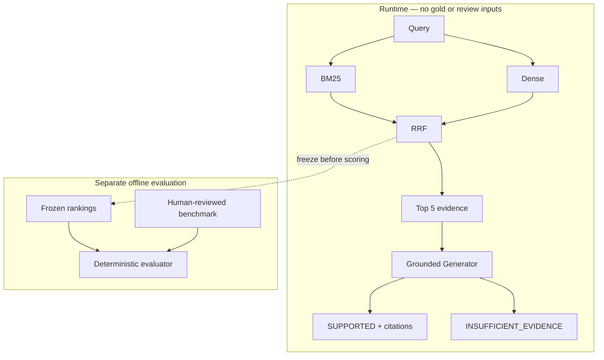

# Version-Aware RAG MVP

**Relevant does not necessarily mean valid.** A measured, installable technical
RAG system for Pydantic 1.10.13 → 2.5.3, with frozen hybrid retrieval, source-linked
answers and explicit insufficient-evidence responses.

## The problem

A highly relevant API passage can describe the wrong version. Conversely, a V2
migration guide may validly explain V1 behavior; deprecated is not removed.
This project separates topical relevance, query-relative version applicability,
document snapshots and evidence sufficiency, then measures where methods fail.
It is a bounded engineering experiment—not a universal compatibility checker.

## Architecture



Runtime uses immutable content and trusted provenance, never benchmark labels.
Context contains exactly five RRF results in order. Document text is untrusted
data separated from the fixed instruction. Citations resolve to evidence IDs,
exact snapshots, paths and physical line/assembled character locators.

## Evaluation and held-out results

The corpus has **34 evidence units**, from 20 documentation/example sources and
two release snapshots. The 16 held-out questions have **544 explicitly
human-reviewed query–evidence pairs**, 12 answerable questions and four
corpus-relative unanswerable questions. Questions and initial annotations were
AI-assisted, followed by explicit single-human batch review—not blind annotation
or multi-reviewer agreement. Development and held-out behavior families are isolated;
documents are shared. Rankings were frozen before gold was loaded for scoring.

| Method | Recall@1 | Recall@3 | Recall@5 | MRR | Wrong-version@3 | UFPR |
|---|---:|---:|---:|---:|---:|---:|
| BM25 | .3750 | .6556 | .7139 | .7361 | .0208 | 1 |
| Dense | .3500 | .7389 | .7833 | .7917 | .0208 | 1 |
| **RRF (default)** | .3500 | **.7833** | **.8111** | **.8333** | .0208 | 1 |
| Cross-Encoder | .3917 | .6750 | .7028 | .8160 | 0 | 1 |

Recall is version-valid evidence-unit recall, macro-averaged over 12 answerable
questions. MRR uses each method's full submitted list (Cross-Encoder: 20 candidates;
Dense/RRF: 34). Wrong-version rate is item-weighted; UFPR measures nonempty results
on the four unanswerable questions. [Full definitions and results](docs/M2.6b-heldout-results.md).

### Decisions, including negative results

- **RRF is the default:** strongest held-out Recall@3/5 and MRR, fixed K=60,
  equal weights and deterministic ties. BM25 uses k1=1.2/b=.75; Dense is exact
  normalized cosine over a pinned local encoder.
- **Positive applicability tiering was not adopted:** it displaced useful evidence
  with unrelated endpoint matches. The 38 corpus assertions remain pending human
  review and cannot express query-relative invalidity. [Ablation](docs/M2.4.md).
- **Cross-Encoder remains an ablation:** its development Recall advantage did not
  transfer. It moved the sole reviewed held-out wrong-version negative from RRF
  rank 1 to rank 6, outside Top 5, but reduced Recall@3/5 and MRR. One negative
  pair is insufficient to estimate broad version correctness.
- **Retrieval UFPR=1 remains visible:** ranking returned candidates for every
  absence question; scores are not a calibrated sufficiency test. Generation adds
  explicit abstention, not a claim that the retrieval problem is solved.

## Grounded answering and abstention

The immutable result is `status`, `answer`, `citations`, `support_summary`.
`SUPPORTED` requires nonempty answer/support and unique supplied evidence IDs.
`INSUFFICIENT_EVIDENCE` has empty answer/citations and explains missing support.
Local validation checks structure and ID membership, **not factual entailment**.
Malformed responses and provider failures are errors, not invented abstentions.

Three predeclared checks used exactly `gpt-5.6-sol` with default reasoning, the
fixed prompt/schema and RRF Top 5. Two returned SUPPORTED and one
INSUFFICIENT_EVIDENCE. After outputs were frozen, review-only checks found
**decision matches 3/3 and reviewed-valid citations 3/3**. These are not 100%
answer accuracy, runtime verification or calibrated abstention.
[Exact outputs and boundaries](docs/M3.1.md).

## Quickstart: install the GitHub Release

Python **3.12** is tested (package requires Python ≥3.12). Create and activate a
virtual environment, then install the wheel and runtime dependencies in one command:

```sh
python3.12 -m venv .venv
. .venv/bin/activate
python -m pip install "version-aware-retriever[dense] @ https://github.com/meiming2019-web/version-aware-retriever/releases/download/v0.1.0/version_aware_retriever-0.1.0-py3-none-any.whl"

# One-time download of the exact dense-model snapshot into the external HF cache:
python -m version_aware_retriever.dense prepare

# Local retrieval only; no OpenAI key or generation call:
version-aware-retriever --query "In Pydantic 2.5.3, how do I validate a dictionary into a model?" --context-only
```

Dense uses `Alibaba-NLP/gte-modernbert-base` at
`e7f32e3c00f91d699e8c43b53106206bcc72bb22`, CPU float32, published CLS pooling,
batch four, input limit 8192 with length checks. Preparation requires network and
disk space for external weights; answering loads local files only. No models are
bundled. No editable checkout is needed. Runtime data is only the pinned
evidence/manifest and upstream notices; gold/review/results are absent from the
wheel. Optional `--root` explicitly selects a source checkout; default is package resources.

### Generate an answer

Supply your own key through the environment; do not put keys in files or Git:

```sh
# Set OPENAI_API_KEY in your shell or secret manager.
export OPENAI_MODEL=gpt-5.6-sol
version-aware-retriever --query "In Pydantic 2.5.3, how do I validate a dictionary into a model?"
# The module CLI remains available:
python -m version_aware_retriever.grounded_answer --help
```

This makes a paid OpenAI Responses request with store=false, structured output,
4096 maximum output tokens, default reasoning and a 180-second transport timeout.
The question and five documentation excerpts are sent to OpenAI. No tools,
automatic retries or provider/model fallbacks. Access to the exact model is required.
Base package and generation adapter use the standard library; `[dense]` adds
Torch/Transformers/Sentence Transformers for normal answering. `[reranker]` is
for the ablation, not the default. No extra generation SDK is needed.

If Python has no usable CA bundle, point `SSL_CERT_FILE` at an existing trusted
bundle, for example `export SSL_CERT_FILE="$(python -c 'import certifi; print(certifi.where())')"`
when certifi is installed. Keep certificate and hostname verification enabled;
never disable TLS verification or commit private CA material.

## Validate and reproduce from source

```sh
git clone https://github.com/meiming2019-web/version-aware-retriever.git
cd version-aware-retriever
git switch --detach v0.1.0
python3.12 -m venv .venv
. .venv/bin/activate
python -m pip install -e '.[dev]'
pytest
ruff check .
ruff format --check .
mypy --strict
git diff --check
python -m version_aware_retriever.acquisition verify
python -m version_aware_retriever.extraction verify

# Optional: score existing frozen runs against reviewed gold only.
# No neural inference, downloads, generation or artifact writes:
python -c "from pathlib import Path; from version_aware_retriever.heldout_evaluation import score; print(score(Path('.')).decode())"

# Build the wheel and source distribution:
python -m build
```

Tests use fake encoders/generators and require no model credentials or network.
Historical reports document original experiments; their run commands are **not**
instructions to repeat or tune the final held-out experiment. Wheel, sdist,
checksums and [release notes](docs/releases/v0.1.0.md) are at
[v0.1.0](https://github.com/meiming2019-web/version-aware-retriever/releases/tag/v0.1.0).
The sdist retains tests and reproducibility data; wheel data is runtime-only.
This project is not published to PyPI.

## Repository map and detailed records

```text
src/version_aware_retriever/   contracts, retrieval, evaluator, grounded CLI
  runtime/                   exact evidence/manifest + upstream notices
data/pydantic/                canonical corpus, reviewed benchmark, frozen runs/results
tests/                       deterministic offline checks
docs/                        design, audits, qualitative outputs
docs/PORTFOLIO.md             resume bullets and interview material
```

[HLD](docs/HLD.md) records the initial design; later measured decisions supersede
exploratory filtering ideas. See [corpus fidelity](docs/M1.2c.md),
[applicability audit](docs/M1.2c-applicability-review.md),
[held-out review](docs/M2.6a-heldout-batch-review.md),
[retrieval results](docs/M2.6b-heldout-results.md),
[grounded answering](docs/M3.1.md), and [portfolio](docs/PORTFOLIO.md).

## Limitations and licensing

Small single-ecosystem corpus, shared documents, AI-assisted/non-blind authoring,
single-human batch review, one held-out hard negative, and three qualitative
generation checks. Top 5 can omit essential evidence; valid citation IDs can fail
to support a claim. The prompt boundary is not proven injection resistance.
No serving/traffic, production readiness, universal superiority or answer-accuracy claim.

No root license has been selected for this project's own code. Public availability
does not grant an open-source license. Pydantic excerpts retain upstream MIT notices
in the archive and package. Model/provider terms are separate. This is a portfolio
engineering release, not a production service.
