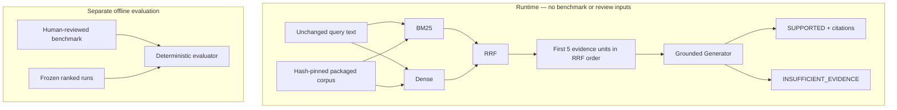

# Shipped architecture: v0.1.2

This is the canonical current-system description for the v0.1.x MVP. The
[initial HLD](HLD.md) and [milestone records](README.md) explain its development;
their abandoned filtering, context-selection and reranking proposals are not
current runtime behavior. v0.1.2 changes engineering infrastructure, not algorithms.

## Purpose and boundary

The system retrieves frozen Pydantic documentation and answers questions from
that supplied evidence, or reports insufficient evidence. Its thesis is that
topical relevance does not establish validity for a requested software version.
The bounded corpus covers exact releases **1.10.13** and **2.5.3**, with 34
evidence units assembled from 20 content sources and two upstream license artifacts.

The CLI accepts unchanged nonempty question text, including any versions the user
states. It does not infer a version, parse a structured version request, rewrite
the query or add a default endpoint. The final retriever is content-only hybrid
RRF, not a validated version-correctness classifier.

## Runtime and evaluation architecture

Evaluation reads retained rankings only after they have been frozen. No arrow
from gold, review decisions or metric results enters retrieval or generation.
`--context-only` returns the same five-unit JSON context before generation;
it still requires the external dense encoder. Import/help/resource loading does not.

## Components and responsibilities

| Component | Shipped responsibility |
|---|---|
| [grounded_answer.py](../src/version_aware_retriever/grounded_answer.py) | Pinned corpus loading/projection, retrieval composition, context, provider adapter, answer validation and citation rendering |
| [lexical.py](../src/version_aware_retriever/lexical.py) | Fixed tokenizer and BM25 ranking |
| [dense.py](../src/version_aware_retriever/dense.py) | Pinned local encoder, length checks, normalized vectors and exact cosine ranking |
| [hybrid.py](../src/version_aware_retriever/hybrid.py) | Rank-only reciprocal rank fusion |
| [contracts.py](../src/version_aware_retriever/contracts.py) | Immutable validated source, evidence, benchmark and ranking contracts |
| [evaluation.py](../src/version_aware_retriever/evaluation.py) | Deterministic reviewed-benchmark metrics, never runtime labels |
| Acquisition/extraction and pilot/held-out adapters | Offline corpus preparation, experiment orchestration and review/scoring gates |

`version_aware.py` and `reranker.py` retain measured ablations, not default runtime
stages. Historical batch functions named `run_development` also serve existing
wrappers; that naming debt is preserved rather than refactoring frozen implementations.

## Runtime data flow

1. Load and hash-check the two pinned corpus files. Project units into content,
   evidence ID, ecosystem, section ancestry and contribution provenance.
2. Sort units by evidence ID. BM25 indexes unchanged content. The encoder processes
   all 34 content strings plus the unchanged question, after explicit length checks.
3. Rank with BM25 and exact dense cosine; fuse their full returned rankings. Take
   exactly the first five results, with no filters, second reranker or selection pass.
4. Serialize the question and five evidence objects as JSON, preserving content
   and order. `--context-only` stops here; otherwise send that data to the generator.
5. Validate the returned structure and citation membership. Render cited source
   snapshots, paths, section ancestry and line/character locators beside the answer.

BM25 casefolds Unicode word/underscore tokens, uses distinct query terms,
k1=1.2/b=.75 and positive-log IDF, and returns only positive scores. Dense uses
`Alibaba-NLP/gte-modernbert-base` at
`e7f32e3c00f91d699e8c43b53106206bcc72bb22`: CPU float32, published CLS pooling,
batch four, SDPA and normalized embeddings. Invalid or over-8192-token inputs
fail length checks; silent truncation is not the policy. Cosine scoring uses
normalized Python float vectors and `math.fsum`.

RRF uses K=60, equal weights, one-indexed ranks and zero contribution for absent
items. It combines ranks, not incomparable raw scores. All three stages resolve
exact score ties by evidence ID. The answering path rebuilds indexes/embeddings
per invocation; it does not maintain a serving index or write a new vector cache.

## Packaged corpus and resource loading

The wheel's `version_aware_retriever/runtime/` contains byte-identical copies of
canonical `evidence.json` and `manifest.json`, plus two upstream MIT license files
and a provenance notice. Default loading uses `importlib.resources`, not CWD or
a repository-relative path. An explicitly supplied `--root` selects a checkout;
its pinned hashes and existing symlink checks still apply, with no silent fallback.

The loader validates artifact SHA-256 values, every unit's content hash, unique
34-unit inventory, ecosystem consistency and exact document snapshots. Provenance
retains commit/release, document type, source path/title and contribution locators:
physical source lines are inclusive; assembled character spans are half-open.
Package tests detect divergence from canonical resources. Hashes bind the chosen
revision; they are not independent validation of documentation claims.

Wheel data excludes benchmark questions/gold, review sidecars, historical rankings,
results and raw source trees. Those remain in Git and the sdist for reproducibility.
Corpus applicability assertions exist in the immutable evidence artifact, but are
not projected into ranking features or model context. All **38 remain pending
human review**. Query-specific benchmark approval does not approve them globally.

## Trust boundary and grounded generation

Only the fixed instruction occupies the system role. The question and retrieved
text are JSON data; escaping prevents them from creating structural message roles
or sibling fields. Retrieved instructions remain untrusted. This is a structural
boundary, not proven model resistance to prompt injection.

Ranking consumes content, not review labels. Generation receives content and
provenance, not applicability assertions, curation, categories, families or gold.
A document snapshot is distinct from the behavior described: a newer migration
guide may support older behavior, and deprecation is not removal.

The standard-library OpenAI Responses adapter requires an explicitly configured
model and environment key. The recorded qualitative experiment used exactly
`gpt-5.6-sol`, with reasoning omitted (recorded default medium), `store=false`,
4096 maximum output tokens, strict Structured Outputs and a 180-second transport
timeout. That is an experiment binding, not a silently supplied CLI model default.
There are no tools, automatic retries or provider/model fallbacks. Questions and
five excerpts leave the machine only when generation is explicitly invoked.

## Answers, abstention and failures

`GroundedAnswer` is immutable with `status`, `answer`, `citations` and
`support_summary`. `SUPPORTED` requires nonblank answer/support and unique supplied
evidence IDs. `INSUFFICIENT_EVIDENCE` requires empty answer/citations and an
explanation of missing support. The prompt asks for inline citations for substantive
claims; local validation checks schema and ID membership, not entailment, complete
claim coverage or query-relative version correctness.

Missing/corrupt inputs, invalid vectors, model unavailability, malformed/refused/
incomplete provider responses and transport failures are errors, not fabricated
abstentions. The adapter bounds and sanitizes provider diagnostic fields. TLS
verification stays enabled; an existing trusted CA bundle may be selected through
`SSL_CERT_FILE`. Keys, private CAs and model weights are not shipped.

## Evaluation and reproducibility

The reviewed development pilot has four questions/136 pairs. Held-out evaluation
has 16 questions/544 pairs: 12 answerable, four corpus-relative unanswerable and
one reviewed wrong-version hard negative. Families are isolated across splits,
but documents are shared. AI-assisted annotations received explicit single-human
batch review, not independent multi-annotator agreement or runtime verification.

Version-valid evidence-unit Recall@1/3/5 and MRR are macro-averaged over answerable
questions; wrong-version rate is item-weighted, and UFPR measures nonempty retrieval
on corpus-relative absence questions. Unknown applicability is not invalidity.
The [frozen results](M2.6b-heldout-results.md) retain exact bindings and denominators.

Deterministic score serialization, source/run hashes, no-op writes and fixed tie
rules support same-environment reproducibility. [Frozen environment constraints](../constraints/frozen-eval.txt)
come from committed neural-run package records, not a fresh developer environment.
They do not pin every transitive dependency or guarantee cross-hardware bit identity.
See the [documentation index](README.md) for installation/scoring instructions;
recorded neural rankings and qualitative outputs are not regenerated by this release.

## Engineering decisions and measured limitations

- **BM25 + Dense:** complementary identifier and semantic matching, tested as
  separate baselines before fusion, without query rewriting.
- **RRF default:** strongest held-out Recall@3 **.7833**, Recall@5 **.8111** and
  MRR **.8333**, with no score calibration or post-held-out tuning.
- **No hard metadata tiers:** positive endpoint matches displaced relevant
  passages in the development ablation. Pending metadata cannot express explicit
  query-relative invalidity. [M2.4](M2.4.md) remains visible, not silently repaired.
- **No default Cross-Encoder:** the pinned BGE ablation improved top-one recall
  and moved the sole held-out negative outside Top 5, but reduced Recall@3/5 and
  MRR. Its development recall gains did not transfer. Its frozen revision/settings
  remain in [M2.5](M2.5.md); it is not invoked by ordinary answering.
- **UFPR versus sufficiency:** retrieval UFPR remains **1**; ranking scores are
  not an answerability test. The three frozen generation examples yielded **3/3
  decision matches and 3/3 reviewed-valid citations**, not answer accuracy or
  calibrated abstention. A valid ID may still fail to support a generated claim.
- **Minimal distribution:** package only immutable runtime data, leaving reviewed
  evaluation material outside the answering path. Base imports/resource loading
  need no neural extras; ordinary answering needs the existing `[dense]` extra
  and external pinned model cache. Generation itself adds no SDK dependency.

## Engineering gates and non-goals

CI has independent source-quality and clean-package jobs, one Python version,
full-SHA official Action references and read-only token permissions. The package
job builds wheel/sdist, installs the wheel without extras in a fresh external venv,
checks both CLI help paths and invokes the real resource loader under a checkout/
network read guard. It does not download weights or run neural inference/generation.

The MVP has no online serving evidence, distributed index, query rewriting, agent
framework, UI, production ACLs/SLOs or calibrated sufficiency classifier. Small
single-ecosystem data, shared documents, non-blind authoring, sparse negatives,
Top-5 evidence loss and imperfect entailment remain explicit limits. Frozen method
changes require a new experiment/benchmark revision, not replacement of these results.
